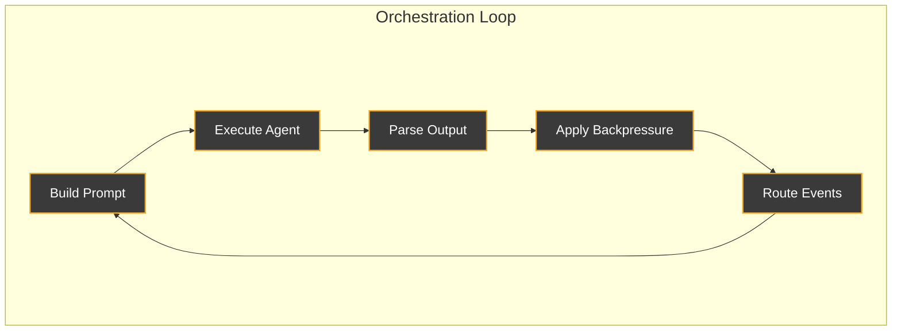
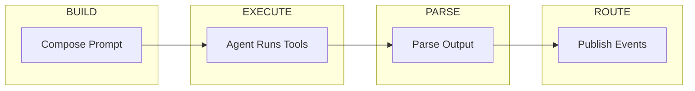

# Orchestration Workflow

This document describes Ralph's orchestration workflow - the cycle of prompt generation, agent execution, output parsing, and event routing that enables autonomous task completion.

## The Big Picture

Ralph orchestrates AI agents through an **iterative loop**:



Each iteration:

1. **Build Prompt** - Compose system prompt with context, events, and instructions
2. **Execute Agent** - Run Claude/Gemini/etc. with the prompt
3. **Parse Output** - Extract events, completion signals, and artifacts
4. **Apply Backpressure** - Run tests, lints, and quality gates
5. **Route Events** - Deliver events to appropriate hats for next iteration

## Execution Modes

Ralph operates in one of several modes based on configuration:

### Solo Mode (Default)

No hats defined. Ralph does everything - planning, implementing, testing, committing.

```
ralph run -p "Add user authentication"
```

**Flow**:
```
task.start → Ralph (plan + implement + commit) → LOOP_COMPLETE
```

**System prompt includes**: Full WORKFLOW section with 5 steps.

### Multi-Hat Mode

Hats are personas that Ralph wears — NOT separate agents. When hats are defined, Ralph switches between them based on events, receiving different instructions for each persona.

```yaml
hats:
  builder:
    triggers: [build.task]
    publishes: [build.done, build.blocked]
```

**How hat switching works**:

1. An event is published (e.g., `build.task`)
2. The EventBus finds hats whose `triggers` match that event topic
3. Ralph "puts on" the matching hat for the next iteration
4. The hat's `instructions` are injected into Ralph's system prompt
5. Ralph executes, then emits new events
6. Ralph "takes off" that hat, and the cycle repeats with whoever triggers next

Think of it as one actor playing multiple roles in a play — same agent, different costumes and scripts.

**Flow**:
```
task.start → Ralph-as-Planner → build.task → Ralph-as-Builder → build.done → Ralph-as-Verifier → LOOP_COMPLETE
```

**System prompt includes**: HATS topology table, DELEGATE workflow, event constraints, and the active hat's instructions.

### Resume Mode

Continuing from a previous interrupted run.

```
ralph run --continue
```

**Flow**:
```
task.resume → Ralph (read existing scratchpad) → continue work
```

**Key difference**: Scratchpad is preserved, not cleared. Event is `task.resume` instead of `task.start`.

---

## Detailed Workflow Phases

### Phase 1: Initialization

When `ralph run` starts:

```rust
// Simplified from loop_runner.rs
if !resume {
    // Fresh start: clear scratchpad
    fs::remove_file(&scratchpad_path)?;
    // Create new events file
    let events_path = format!(".ralph/events-{}.jsonl", timestamp);
}

// Write loop ID marker (for task ownership)
fs::write(".ralph/current-loop-id", &loop_id)?;

// Initialize event loop
if resume {
    event_loop.initialize_resume(&prompt);  // → task.resume
} else {
    event_loop.initialize(&prompt);          // → task.start
}
```

**What this means for the agent**:

- Fresh runs start with clean state
- Resume runs see existing scratchpad content
- Loop ID tracks which tasks belong to which run

### Phase 2: Prompt Building

Before each agent invocation, Ralph builds the system prompt:

```rust
// Simplified from event_loop/mod.rs
fn build_prompt(&self, hat_id: &HatId) -> String {
    // Get pending events for this hat
    let events = self.bus.pending_events_for(hat_id);

    // Build context string from events
    let context = events.iter()
        .map(|e| format!("Event: {} - {}", e.topic, e.payload))
        .collect();

    // Build the appropriate prompt
    if hat_id == "ralph" {
        self.ralph.build_prompt(&context, &[])
    } else {
        self.instructions.build_custom_hat(&hat, &context)
    }
}

// If memories enabled, prepend them
if self.config.memories.enabled {
    prompt = prepend_memories(prompt, &memories_content);
}
```

**The resulting prompt contains**:

- Current objective (what the user asked for)
- Pending events (what triggered this iteration)
- Workflow instructions (what to do)
- Constraints and guardrails (what not to do)
- Available context (what resources exist)

### Phase 3: Agent Execution

The prompt is passed to the backend (Claude, Gemini, etc.):

```rust
// Simplified from adapters
let response = backend.execute(ExecutionContext {
    prompt: &system_prompt,
    custom_args: &config.cli.custom_args,
    workspace_root: &ctx.workspace(),
})?;
```

**What happens**:

1. Backend spawns CLI process (e.g., `claude --system-prompt /tmp/ralph-xxx.md`)
2. Agent reads files, writes code, runs commands
3. Agent emits events via `ralph emit`
4. Agent outputs text (possibly containing completion promise)
5. Backend captures all output

### Phase 4: Output Parsing

After agent completes, Ralph parses the output:

```rust
// Simplified from event_parser.rs
let parsed = EventParser::parse(&output, &events_file);

// Check for completion promise
if parsed.contains_promise(&config.completion_promise) {
    return TerminationReason::CompletionPromise;
}

// Extract events from events file
let new_events = parsed.events;
```

**What Ralph looks for**:

- Completion promise (e.g., `LOOP_COMPLETE`) → end the loop
- Events in `.ralph/events.jsonl` → route to next hats
- Error patterns → log diagnostics

### Phase 5: Event Routing

New events are published to the event bus:

```rust
// Simplified from event_loop/mod.rs
for event in new_events {
    self.bus.publish(event);
}

// Determine next hat
if let Some(next_hat) = self.bus.next_hat_with_pending() {
    // Continue to next iteration with this hat
} else {
    // No pending events - loop terminates
    return TerminationReason::NoPendingEvents;
}
```

**Event routing rules**:

- Events are routed to hats that subscribe to their topic
- In multi-hat mode, Ralph always executes (hats define topology only)
- If no hat has pending events, loop terminates

### Phase 6: Backpressure (Implicit)

Backpressure happens during agent execution, not as a separate phase. The agent is instructed to run tests and verify work before proceeding.

**From the system prompt**:
```
1001. Backpressure is law - tests/typecheck/lint must pass
```

**What this means**:

- Agent must run verification commands
- If tests fail, agent should fix before continuing
- Quality gates are self-enforced by the agent

---

## Iteration Lifecycle

A single iteration looks like this:

<div style="min-height: 800px;">



</div>

During execution, the agent writes:

- Code files
- Scratchpad updates
- Events file
- Test runs

!!! info "Iteration Timing"
    **Duration**: Varies widely (seconds to minutes) depending on task complexity.

    **Context**: Each iteration gets a fresh context window. The scratchpad and events persist, but the agent's "memory" resets.

---

## State Persistence

Ralph maintains state across iterations through files:

| File | Purpose | Lifecycle |
|------|---------|-----------|
| `.ralph/agent/scratchpad.md` | Working memory | Cleared on fresh run |
| `.ralph/agent/tasks.jsonl` | Structured tasks | Persists forever |
| `.ralph/agent/memories.md` | Long-term learnings | Persists forever |
| `.ralph/events-{timestamp}.jsonl` | Event history | Per-run |
| `.ralph/current-loop-id` | Task ownership marker | Per-run |
| `.ralph/current-events` | Events file pointer | Per-run |

---

## Termination Conditions

The loop terminates when:

| Condition | Exit Code | Meaning |
|-----------|-----------|---------|
| `CompletionPromise` | 0 | Agent output contains the completion promise |
| `MaxIterations` | 1 | Hit `max_iterations` limit |
| `NoPendingEvents` | 0 | No hats have pending events |
| `Timeout` | 1 | Exceeded `idle_timeout_secs` |
| `UserCancel` | 130 | User pressed Ctrl+C |
| `Error` | 1 | Unrecoverable error |

---

## The Role of System Prompts

System prompts are the **control plane** of orchestration. They:

1. **Set Boundaries**: Define what the agent can and cannot do
2. **Provide Context**: Tell the agent what's happening and what to work on
3. **Teach Tools**: Explain available CLI commands and conventions
4. **Enforce Patterns**: Guide the agent through a consistent workflow
5. **Enable Coordination**: In multi-hat mode, define the event topology

### Prompt → Behavior Mapping

| Prompt Section | Resulting Behavior |
|----------------|-------------------|
| ORIENTATION | Agent understands it's iterative, does one task |
| SCRATCHPAD | Agent uses checkbox notation for progress |
| TASKS | Agent uses `ralph tools task` commands |
| WORKFLOW | Agent follows the prescribed steps |
| GUARDRAILS | Agent runs tests, doesn't assume things |
| EVENT WRITING | Agent uses `ralph emit` correctly |
| DONE | Agent outputs completion promise when done |

### Why Dynamic Composition?

The prompt changes based on context because:

1. **Token efficiency**: Don't include hat topology in solo mode
2. **Focus**: Active hats don't need to see the full topology
3. **Feature flags**: Don't mention tasks if memories disabled
4. **Progressive disclosure**: Fast path skips planning when appropriate

---

## Example: Full Orchestration Run

Let's trace through a complete run:

```bash
ralph run -p "Add a health check endpoint at /healthz"
```

### Iteration 1: Planning

**Events**: `task.start: Add a health check endpoint at /healthz`

**Prompt includes**:

- OBJECTIVE: Add a health check endpoint at /healthz
- WORKFLOW: 5 steps (study, plan, implement, commit, repeat)
- SCRATCHPAD: Track progress here

**Agent actions**:

1. Reads existing codebase structure
2. Creates scratchpad with plan:
   ```markdown
   # Health Check Implementation

   ## Tasks
   - [ ] Create /healthz route handler
   - [ ] Add health check service
   - [ ] Write tests
   ```
3. Picks first task, implements route handler
4. Runs tests
5. Commits: "Add /healthz endpoint route handler"
6. Marks task `[x]`
7. Updates scratchpad

**Output**: Agent continues (no LOOP_COMPLETE yet)

### Iteration 2: Implementation

**Events**: None (continuing from scratchpad)

**Agent actions**:

1. Reads scratchpad, sees remaining tasks
2. Picks next task: health check service
3. Implements service
4. Runs tests
5. Commits
6. Marks task `[x]`

**Output**: Agent continues

### Iteration 3: Completion

**Events**: None (continuing from scratchpad)

**Agent actions**:

1. Reads scratchpad, sees one task remaining
2. Writes tests
3. Runs tests - they pass
4. Commits
5. Marks all tasks `[x]`
6. Verifies: all tasks done

**Output**: `LOOP_COMPLETE`

### Termination

Ralph detects `LOOP_COMPLETE` in output → exits with code 0.

---

## Multi-Hat Example

With hats configured:

```yaml
hats:
  builder:
    triggers: [build.task]
    publishes: [build.done, build.blocked]
```

### Iteration 1: Ralph Plans

**Events**: `task.start: Add health check`

**Prompt includes**: HATS topology, DELEGATE workflow

**Agent actions**:

1. Creates scratchpad with plan
2. Emits: `ralph emit "build.task" "Implement /healthz endpoint"`

**Output**: Event published

### Iteration 2: Ralph Executes as Builder

**Events**: `build.task: Implement /healthz endpoint`

**Prompt includes**: ACTIVE HAT: Builder, execution instructions

**Agent actions**:

1. Implements the endpoint
2. Runs tests
3. Commits
4. Emits: `ralph emit "build.done" "implemented and tested"`

**Output**: Event published

### Iteration 3: Ralph Verifies

**Events**: `build.done: implemented and tested`

**Agent actions**:

1. Verifies work is complete
2. No more tasks

**Output**: `LOOP_COMPLETE`

---

## Debugging Workflow Issues

### Agent not following workflow?

Check the generated prompt:
```bash
RALPH_DIAGNOSTICS=1 ralph run -p "your task"
cat .ralph/diagnostics/*/orchestration.jsonl | jq '.prompt' | head -100
```

### Events not routing?

Check the events file:
```bash
cat .ralph/events-*.jsonl | jq .
```

### Tasks not showing up?

Check loop ID filtering:
```bash
cat .ralph/current-loop-id
ralph tools task list --all
```

### Agent stopping early?

Check termination reason in output. Common causes:

- No events published (loop thinks it's done)
- Hit max iterations
- Completion promise in unexpected output

---

## See Also

- [System Prompts Reference](./system-prompts.md) - Detailed prompt documentation
- [Event System](./event-system.md) - How events flow between hats
- [Custom Hats](./custom-hats.md) - Defining multi-hat workflows
- [Diagnostics](./diagnostics.md) - Debugging orchestration issues
