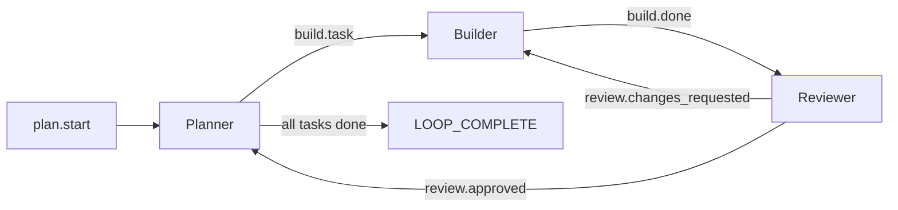

# From Loop to Workflow

The [Ralph Wiggum Technique](ralph-wiggum-technique.md) gives you a simple loop: keep running until success. But real projects need more structure — stages, quality gates, persistent learning, and parallel work streams.

This page shows you how to evolve from a basic loop into a structured workflow, introducing Ralph's building blocks through practical scenarios.

---

## Scenario 1: Building a Fresh Backend Project

You're starting a new API service from scratch. You want Ralph to handle the full lifecycle: planning, implementing, testing, and reviewing.

### The Manual Approach

Without orchestration, you'd coordinate multiple agents yourself:

```
Terminal 1: "Plan the authentication module"
  ↳ Work with the agent iteratively until you have a solid plan
  ↳ Copy the final plan somewhere

Terminal 2: "Implement the plan from Terminal 1"
  ↳ Paste the plan from Terminal 1
  ↳ Wait for implementation...

Terminal 3: "Review what Terminal 2 built"
  ↳ Find issues, go back to Terminal 2...
  ↳ Repeat until satisfied
```

This requires you to:

- Copy-paste context between terminals
- Decide when each "agent" should run
- Handle handoffs when one stage fails
- Track what's done and what's pending

### The Ralph Way: Hats and Events

Instead of manually coordinating, imagine you're building a team to tackle your task. As with any team, you define two things: **roles** and **process**.

1. **Roles**: Define a role for each unique stage (planning, implementing, reviewing)
2. **Process**: Define how those roles work together to achieve your objective

Ralph gives you the ability to do exactly that through **hats** and **events**.

#### How It Works

When you run `ralph run -p "your objective"`, you start an **orchestration loop**. The orchestrator keeps activating new Ralph iterations until either:
- The objective is complete (`LOOP_COMPLETE` is emitted)
- A terminal condition is reached (max iterations, max runtime, etc.)

In each iteration, Ralph needs to figure out two things:
1. **What should I do now?** (determined by which hat is active)
2. **What event should I emit when I'm done?** (to hand off to the next stage)

#### Hats: Roles for Your "Team of One"

You only have one Ralph per loop — but you can define different **hats** that Ralph wears to play different roles. Each hat provides:

- **`triggers`**: Which events activate this hat (e.g., `plan.start`)
- **`instructions`**: What Ralph should do when wearing this hat
- **`publishes`**: Which events Ralph can emit to hand off work

#### Events: The Workflow Glue

Events are how stages connect. When Ralph finishes work in one hat, it emits an event. That event triggers the next hat. This creates your workflow topology.

Think of it as: **triggers** define *inputs*, **publishes** define *outputs*, and the orchestrator routes events between them.

```yaml
# ralph.yml
hats:
  planner:
    name: "📋 Planner"
    description: "Analyzes requirements and breaks work into atomic tasks"
    triggers: ["plan.start"]
    publishes: ["build.task"]
    instructions: |
      You are the architect. Your job is to:
      1. Analyze the requirements
      2. Break the work into atomic tasks
      3. Emit ONE build.task at a time

      Do NOT implement. Just plan.

  builder:
    name: "🔨 Builder"
    description: "Implements tasks following existing patterns"
    triggers: ["build.task"]
    publishes: ["build.done", "build.blocked"]  # Ralph chooses ONE based on outcome
    instructions: |
      You are the implementer. Your job is to:
      1. Read the task from the event payload
      2. Implement it following existing patterns
      3. Run tests before declaring done
      4. Emit build.done if tests pass, or build.blocked if stuck

  reviewer:
    name: "🔍 Reviewer"
    description: "Reviews code for quality and security issues"
    triggers: ["build.done"]
    publishes: ["review.approved", "review.changes_requested"]  # Ralph chooses ONE
    instructions: |
      You are the code reviewer. Your job is to:
      1. Check the recent commits
      2. Verify tests exist and pass
      3. Look for security issues
      4. Emit review.approved if quality is good, or review.changes_requested if issues found
```

> **How does Ralph choose which event to emit?** The `publishes` list defines what events are *allowed*. Ralph reads the situation (tests passing? issues found?) and picks the appropriate one. Your `instructions` should guide this decision.

Now run it:

```bash
ralph run -p "Build a REST API for user management with JWT auth"
```

What happens:



### What a Hat Actually Is

Here's the key insight: **Ralph is always the one executing** — it just wears different "hats" based on which events are pending. A hat is a configuration bundle that changes Ralph's behavior for one iteration:

| What a Hat IS | What a Hat is NOT |
|---------------|-------------------|
| Instructions injected into the prompt | A separate agent process |
| A routing filter (which events activate it) | Separate memory |
| Constraints (which events it can emit) | Separate context window |
| Optional backend override (use Claude for review, Gemini for coding) | A different AI instance |

All hats share the same:

- Memory file (`.ralph/agent/memories.md`)
- Task list (`.ralph/agent/tasks.jsonl`)
- Git worktree
- Project context

---

## Scenario 2: Parallel Feature Development

You have an existing project. You want to work on multiple features simultaneously — the auth system AND the payment integration, at the same time.

### The Problem

If you run two `ralph run` commands in the same repo:

- They'll overwrite each other's files
- They'll conflict on the same git branch
- They'll interfere with each other's progress tracking

### The Ralph Way: Parallel Loops with Worktrees

Ralph handles this automatically. When you start a second loop while one is already running:

```bash
# Terminal 1: Start the first loop (becomes "primary")
ralph run -p "Implement user authentication"

# Terminal 2: Start a second loop (auto-spawns into worktree)
ralph run -p "Implement payment integration"
```

The second loop automatically:

1. Detects the primary loop via `.ralph/loop.lock`
2. Creates a git worktree at `.worktrees/<loop-id>/`
3. Runs in complete filesystem isolation
4. Queues for merge when complete

```
Main Workspace (Primary Loop)
├── .ralph/loop.lock          # Held by primary
├── .ralph/loops.json         # Registry of all loops
├── src/auth/...              # Auth work happens here
│
└── .worktrees/
    └── loop-1738400000-a3f2/ # Worktree for secondary loop
        ├── src/payments/...   # Payment work happens here
        └── (isolated branch)
```

Monitor all running loops:

```bash
ralph loops
```

### Hats vs Parallel Loops: The Critical Distinction

These are **completely different concepts** that solve different problems:

| Hats (Single Process) | Parallel Loops (Multiple Processes) |
|-----------------------|-------------------------------------|
| One Ralph wearing different personas | Multiple Ralph instances |
| Switched by events within one loop | Each has its own event bus |
| Shared memories and tasks | Filesystem isolation via worktrees |
| Same git branch | Separate branches, merge queue |
| **Use for**: different stages of one task | **Use for**: independent features |

---

## Scenario 3: Adding Quality Gates

Your Ralph loop keeps producing code that fails in CI. The agent sometimes skips tests, or declares success with failing tests.

### The Problem

By default, Ralph trusts the agent to run tests. But agents are optimistic — they want to declare victory and move on.

### The Ralph Way: Backpressure

Backpressure is built into Ralph's event validation. When a hat emits `build.done`, Ralph checks the payload for evidence of passing checks:

```bash
ralph emit "build.done" "tests: pass, lint: pass, typecheck: pass"
```

If evidence is missing or shows failures, Ralph can reject the completion. The agent learns to run verification because that's the only way to proceed.

Evidence is provided in the event payload — not through a separate YAML config.

### The Philosophy

> "Don't prescribe how; create gates that reject bad work."

Instead of telling the agent "run tests before committing," you create a gate that fails if tests don't pass. The agent learns to run tests because that's the only way forward.

This is one of Ralph's [Six Tenets](tenets.md): **Backpressure Over Prescription**.

---

## Scenario 4: Learning Across Sessions

You've been using Ralph on your project for weeks — running `ralph run` for various features, bug fixes, and refactoring tasks. Every time you start a new loop, the agent makes the same mistakes: it forgets to update the changelog, uses an old API pattern you've deprecated, or ignores your team's coding conventions.

### The Problem

Each Ralph loop starts fresh. Each iteration within a loop has fresh context. The agent doesn't remember what it learned in previous loops or even earlier iterations.

### The Ralph Way: Memories

Memories persist across sessions. The agent reads them at the start of each iteration and can write new learnings.

```markdown
<!-- .ralph/agent/memories.md -->

## Project Patterns

- Always use `Result<T, AppError>` for error handling, not `anyhow`
- Update CHANGELOG.md for any user-facing changes
- Prefer `tracing` macros over `println!` for logging

## Past Mistakes

- 2026-01-15: Forgot to run `cargo fmt` - added to pre-commit hook
- 2026-01-20: Used deprecated `v1` API endpoint - always use `/api/v2`

## Team Preferences

- Keep functions under 50 lines
- Prefer composition over inheritance
- All public APIs need doc comments
```

The agent reads this at the start and avoids repeating mistakes.

### Memories vs Tasks

| Memories | Tasks |
|----------|-------|
| Long-term learnings | Current work items |
| Persist forever | Cleared when completed |
| Read at start of iteration | Checked for completion |
| Write when learning something | Updated as work progresses |

Use **memories** for patterns, preferences, and lessons learned.
Use **tasks** for tracking what needs to be done in the current loop.

---

## Scenario 5: Custom Workflow Events

The built-in events (`task.start`, `build.done`, etc.) don't match your workflow. You have a deployment stage, a database migration stage, and a monitoring setup stage.

### The Problem

You can't find events that match your domain. The planner-builder-reviewer pattern doesn't fit your needs.

### The Ralph Way: Define Your Own Events

Events are just strings — you can use any names you want. The only "special" events are:

- `task.start` / `task.resume` — Reserved for Ralph (loop entry points)
- `LOOP_COMPLETE` — Terminates the loop (configurable via `completion_promise`)
- `build.done` / `review.done` — Have optional backpressure validation

Everything else is yours to define:

```yaml
# ralph.yml
hats:
  migrator:
    name: "🗃️ Migrator"
    description: "Applies database migrations in a transaction"
    triggers: ["migrate.ready"]
    publishes: ["deploy.staging", "migrate.failed"]
    instructions: |
      You are the database migration specialist. Your job is to:
      1. Run migrations in a transaction
      2. Verify schema matches ORM models
      3. Emit deploy.staging if successful, migrate.failed if not

  deployer:
    name: "🚀 Deployer"
    description: "Builds artifacts and deploys to staging"
    triggers: ["deploy.staging"]
    publishes: ["monitor.setup", "deploy.rollback"]
    instructions: |
      You are the deployment engineer. Your job is to:
      1. Build artifacts
      2. Push to staging environment
      3. Run smoke tests
      4. Emit monitor.setup if successful, deploy.rollback if not

  ops:
    name: "📊 Ops"
    description: "Configures monitoring, metrics, and alerts"
    triggers: ["monitor.setup"]
    publishes: []  # Terminal hat - Ralph will emit LOOP_COMPLETE
    instructions: |
      You are the ops engineer. Your job is to:
      1. Add metrics endpoints
      2. Configure alerts
      3. Verify dashboards
      When done, exit and let Ralph complete the loop.

event_loop:
  starting_event: "migrate.ready"  # Kick off your custom workflow
```

### Event Naming Convention

Events use a `domain.action` naming convention (e.g., `build.done`, `deploy.staging`). The `.` enables glob pattern matching:

| Pattern | Matches |
|---------|---------|
| `build.done` | Exact match only |
| `build.*` | `build.done`, `build.failed`, `build.task` |
| `*.done` | `build.done`, `deploy.done`, `test.done` |
| `*` | Everything (fallback) |

---

## Choosing the Right Approach

| When You Want To... | Use |
|---------------------|-----|
| Different behaviors at different stages of one task | Hats |
| Work on multiple independent features simultaneously | Parallel Loops |
| Enforce quality standards automatically | Backpressure |
| Remember patterns and lessons across sessions | Memories |
| Track current work items | Tasks |
| Define workflow stages that match your domain | Custom events + hats with `starting_event` |

---

## Next Steps

Now that you understand the concepts through examples:

- Learn the [Six Tenets](tenets.md) that guide Ralph's design philosophy
- Dive deeper into [Hats & Events](hats-and-events.md) for the full reference
- Explore [Coordination Patterns](coordination-patterns.md) for advanced workflows
- Set up [Backpressure](backpressure.md) for quality gates
- Understand [Memories & Tasks](memories-and-tasks.md) for state management
